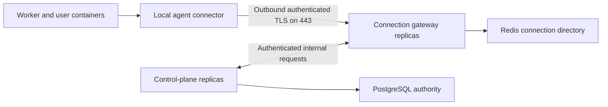

# Outbound agent tunnel

Status: proposed implementation plan. The owner confirms that the app has no active
users and authorizes retirement of obsolete agents and gateways when needed. Plan a
clean cutover with a brief service interruption. Implementation and acceptance have
not run; this document records their scope.

## Outcome

An agent on platform infrastructure, customer infrastructure, or a supported laptop
runtime connects outbound to one LazyCloud service on TCP port 443. The connection
authenticates both ends and carries authorized control and workload traffic. The
customer needs no public machine address, inbound port, private subnet allocation,
WireGuard installation, or host DNS changes.

API and scheduler deployments leave agent connections and running containers alone.
Gateway deployments drain connections and allow agents to reconnect. The final
installation has one agent transport, with no WireGuard or public HTTP fallback.

This changes connectivity. It does not change the supported container runtime on a
laptop, make a sleeping laptop available, or remove customer egress restrictions.
Customers must permit the configured endpoint and protocol. Certificate validation
is never disabled to accommodate an intercepting proxy.

## Target design

The agent initiates connections in both traffic directions. A control-plane request
to a container opens a logical stream through an existing agent session. The agent
resolves an authorized route ID to its registered local workload destination.
Neither the caller nor the gateway can supply an arbitrary customer-network target.

Worker and runner HTTP contracts remain intact. Their canonical runtime destination
becomes the local agent connector, reachable only from the owned worker/container
network. The connector carries those requests over the authenticated tunnel to the
permitted control-plane service. Existing worker and runtime tokens still authorize
the inner request. User containers never receive the machine private key or gain
the agent's authority by calling the connector.

The proposed transport library is asynchronous gRPC over HTTP/2 with mutual TLS.
It supplies TLS, stream framing, flow control, cancellation, and connection reuse.
LazyCloud still owns enrollment, session routing, authorization, and lifecycle.
This is not a claim that a transport library is a complete reverse-tunnel product.
The first implementation slice must prove that the integration stays small and
performs well before this choice is finalized.

Keep control messages separate from bulk stream queues. Bound queued bytes and
concurrent streams per agent and workspace. Reuse established channels on warm
requests. A slow upload or reader must not block heartbeats, cancellation, or another
workspace. Preserve TCP half-close, EOF, errors, and backpressure for proxied traffic.

Expose the tunnel through a dedicated DNS name and a TCP load balancer. TLS terminates
at the connection gateway, which verifies the agent certificate. Do not put a TLS
terminating HTTP proxy in this path and assume it preserved client authentication.
Gateway replicas have their own deployment and readiness, independent of API pods.

## Identity and state ownership

| Owner | Responsibility |
| --- | --- |
| `packages/identity` | Authenticate enrollment, issue and rotate machine credentials, authorize certificate identities, and enforce revocation. |
| `packages/compute` | Own machine enrollment, workload placement, worker admission, and authorized workload routes. A connection does not allocate a machine or recreate a worker. |
| PostgreSQL | Preserve machine/workspace identity, credential generation, revocation, workload routes, and existing durable task state. |
| Redis | Track live session ownership and leases. Store connection metadata, not stream payloads or a second task database. |
| Connection gateway | Hold sockets and bounded stream buffers. Validate operations and route requests to the gateway currently connected to the agent. |
| Agent | Protect its private key, establish the tunnel, and connect only to locally registered workload destinations. |

Enrollment binds a locally generated key to an authorized machine and workspace.
Use standard certificate libraries and a deployment-owned signing credential in
the existing secret system. Customer machines hold only their own keys. Gateway
replicas receive verification material, not the certificate issuer's signing key.
Issuer credentials, trust-bundle rotation, renewal, and recovery must have one owner;
do not add another configurable identity backend.

Certificates are short lived and renew before expiry. Possession of a valid
certificate is insufficient after the enrollment is revoked or its credential
generation changes. Close affected sessions and refuse new streams. Redis
notifications accelerate revocation; bounded checks against durable authority
enforce it even if a notification is lost. Set and prove a maximum revocation delay
of ten seconds under healthy database connectivity. Loss of authorization authority
must not extend access indefinitely.

A directory entry names the enrollment, credential generation, gateway process
identity, and unique connection ID. Publish, renew, replace, and remove it with
atomic ownership checks. A delayed disconnect must never erase a newer connection.
Any API replica can use the directory and contact the owning gateway over an
authenticated internal service connection. Internal callers cannot impersonate
another workspace by sending an untrusted header.

Redis loss rebuilds connection presence through registration. It does not erase
machine identity, reset credentials, create replacement workers, or duplicate task
dispatch. New streams require a current session lease. Existing task fencing,
acknowledgements, and idempotency remain with their current owners.

## Implementation sequence

### 1. Prove one complete transport slice

Build one agent, two gateway replicas, and two API replicas using real local
dependencies and the intended production TLS implementation. Start with the
existing route ID and authorization boundaries rather than a new generic proxy API.

Carry a real function invocation, runtime callback, streamed HTTP response, and
bidirectional shell/TCP connection. Block UDP and inbound access to the agent.
Exercise wrong identities, cross-workspace requests, revoked credentials, a slow
reader, disconnects, and a gateway replacement. Check packaged agent compatibility,
dependency size, cancellation, bounded memory, and concurrent-stream throughput.

Choose and pin the transport dependency after this evidence. If a library requires
us to implement a general multiplexer, custom cryptography, or a large proxy platform,
reconsider it before converting the rest of the repository. Do not keep alternative
transport implementations behind a switch.

Record cold preparation, scheduling, container startup, tunnel connection setup,
and warm invocation time separately. Compare with the same workload and hardware
through the current route. A successful heartbeat does not satisfy this gate.

### 2. Implement the production owners

Add backend-free connection and enrollment contracts under `packages/shared`.
Keep transport-library imports out of the public SDK and runner. Put tunnel
mechanics in `packages/networking`, reusable agent lifetime in `packages/agent`,
and deployable composition in `apps/agent` and the connection gateway app.

Replace the WireGuard process in `apps/tunnel-gateway` with the connection gateway
as the old deployment is retired. Rename the app/package once in that change;
remove the old entrypoints rather than preserving import aliases.

Integrate credential issuance with `packages/identity`, session leases with the
Redis owner, and route authorization with `packages/compute`. API handlers remain
thin. Append Alembic revisions for durable identity changes. Synchronize API,
agent, CLI, worker, runner, and dashboard contracts where they consume changed
fields. Do not rewrite historical migrations.

### 3. Move every traffic consumer

Change `BackendRouteDialer` and its HTTP, container, shell, and stream consumers to
open an authorized tunnel route instead of dialing a peer IP and writing the old
route-preface credential. Preserve the route-ID contract where it still expresses
the workload destination correctly.

Replace the agent's inbound route-proxy listener with local destination dispatch
behind the outbound tunnel. Replace worker runtime address injection with the
owned local connector. Move agent readiness from WireGuard probes to authenticated
session readiness plus a real local worker request.

Inventory image build traffic, object transfer callbacks, logs, cancellation,
checkpoints, endpoint HTTP/WebSockets, and raw TCP paths before deleting their
network dependencies. Preserve independently authorized object-storage transfers.
No consumer receives an environment override that bypasses the production route.

Use the same connector in Compose, packaged agents, platform AWS workers, and
customer-owned workers. Keep container bridges, gVisor isolation, internet egress
rules, resource accounting, and local port restrictions.

### 4. Make one clean cutover

The app has no active users. Do not build a preparation agent, dual-transport
support, a per-enrollment transport selector, or compatibility response adapters.
Do not ship the superseded final WireGuard rollout as a prerequisite. Review
pending changes individually and retain the independent warm-capacity,
execution-revision, and image-cache fixes that the final implementation needs.

Build and validate the complete replacement before changing production. Inventory
the exact obsolete enrollments, managed workers, gateway deployments, Services,
load balancers, DNS records, secret properties, and security-group rules. Read live
tasks and workloads to confirm the cutover will not discard newly submitted work.

Publish the new agent, worker, control-plane, and connection gateway artifacts.
Stop old admissions and processes that can write the retired transport state.
Verify a recoverable database backup before dropping retired transport tables.
Apply the new schema and deploy the replacement. Reinstall agents or revoke their
obsolete enrollments and enroll replacements. Platform-managed worker instances
may be replaced as needed; a customer-owned host receives an agent reinstall,
not deletion of the customer's machine or network.

Verify the running artifacts, certificate identities, route authorization, and
real function/container traffic, then retire the enumerated WireGuard resources.
The existing authenticated installer/enrollment boundary bootstraps the new agent;
no old private network is needed to reach an updater. Keep no old transport as a
runtime fallback. Recovery uses reproducible new artifacts and protected durable
data, not an indefinitely retained WireGuard deployment.

### 5. Delete the old implementation and infrastructure

Include the code and configuration removals in the replacement feature before
merge. The feature is incomplete while unused transports, keys, Services, or
compatibility contracts remain. Execute infrastructure retirement against the
reviewed cutover inventory; it is not a blanket cleanup of customer infrastructure.

| Scope | Removal or replacement |
| --- | --- |
| `packages/networking/src/networking/wireguard*.py` | Delete key management, peer allocation, interfaces, route tables, connection marking, NAT failover, handshake state, and gateway configuration. |
| `apps/tunnel-gateway/src/tunnel_gateway_app/*` | Replace the process owner; delete WireGuard bootstrap, platform peer sidecar, conntrack drain, indexed gateway leases, and old entrypoints. |
| `apps/agent/src/agent_app/daemon.py`, `route_proxy.py` | Delete WireGuard setup/refresh/cleanup and inbound route-proxy machinery. Retain local route authorization and daemon/update lifecycle. |
| `packages/networking/{dialer,routing,settings}.py` under `src/networking` | Replace peer-IP dialing and remove old route-preface HMAC credentials and their shared secret after the last consumer migrates. Preserve useful protocol-neutral route contracts. |
| `packages/shared`, `packages/gateway`, `packages/compute`, `packages/database` | Remove private-network registration/topology APIs, gateway/peer repositories and live models, readiness projections, and obsolete transport selectors. Read all enum and persisted-value consumers before migration. Drop retired tables in a new revision after old writers stop. |
| `apps/cli/src/cli/wireguard.py`, installer and join UI | Delete WireGuard operator commands, installation options, capability probes, and private-network setup instructions. |
| `deploy/chart/templates/wireguard-*.yaml`, control-plane template | Delete UDP gateway Services, bootstrap jobs, key projections, platform WireGuard sidecars, ordinal-bound peer configuration, and gateway sync waves. Retain ordinary API readiness and draining. |
| Terraform, descriptors, images, Compose, release tooling | Remove the retired NLBs, UDP security-group rules, DNS records, keys, WireGuard packages, privileges used only for tunnels, image artifacts, and configuration fields. Add only the connection gateway's required listener, credentials, and release wiring. |
| Tests, runbooks, owning `AGENTS.md` files | Remove WireGuard-only acceptance scenarios and obsolete instructions after replacement behavior passes. Retain tests for security, ownership, isolation, and cleanup that remain applicable. Preserve `CLAUDE.md` symlinks. |

Historical Alembic revisions remain unchanged. Remove transport enum members and
public fields together with their obsolete records and consumers at cutover.
Required container firewall/NAT rules are not WireGuard cleanup targets. Preserve
application data and provider adapters' customer-owned infrastructure behavior.

Review the API-wide HTTP connection-age timer and periodic worker event-stream
rotation introduced for WireGuard drains. Remove mechanisms whose only reason was
retiring tunnel NAT state. Keep ordinary HTTP keepalive handling, acknowledged event
redelivery, and bounded application shutdown where their own contracts require them.

## Deployment and failure behavior

API and scheduler releases do not restart the connection gateway. Gateway changes
roll one replica at a time. A draining gateway leaves service discovery, stops new
admissions, and asks its agents to establish replacement sessions while accepted
streams finish. Publish the replacement ownership before retiring the old session;
old-session cleanup is fenced by its connection ID.

A hard gateway failure can interrupt its in-flight streams. Reconnect promptly and
report uncertain request outcomes. Never replay arbitrary request bodies or imply
that reconnecting a socket guarantees exactly-once execution. Existing durable task
ownership decides whether work was accepted and whether it can be retried.

Long-lived streams have an explicit maximum deployment drain policy. Do not promise
that an indefinitely open connection survives termination of the process owning it.
Adding replicas increases connection capacity; it does not move existing sockets.

## Acceptance and completion

Run existing public workflows through the replacement transport, then cover the
distinct new boundaries. Use focused owner tests only where they uniquely prove a
material invariant. Do not unit-test the acceptance scripts.

- Prove enrollment, renewal, trust rotation, expiry, cross-workspace denial,
  revocation of an existing session, and rejection of arbitrary local destinations.
- Prove a stale disconnect cannot remove the new session, Redis restart rebuilds
  presence, and reconnect does not recreate a worker or duplicate a task.
- Run functions, runtime callbacks, endpoint HTTP/WebSockets, logs, shell/TCP,
  cancellation, and image-build traffic while replacing each API, scheduler,
  gateway, and agent independently. Include a slow stream alongside ordinary calls.
- Repeat on platform AWS, customer AWS using its designated acceptance profile, and
  a customer-style network with UDP/inbound traffic blocked. Exercise another cloud
  and an actual supported laptop runtime before claiming those environments pass.
  Missing credentials or hosts remain explicit acceptance gaps.
- Record latency distributions, recovery time, memory under backpressure, active
  streams, gateway bandwidth/cost, task receipt, container startup, and terminal
  outcomes. Warm-call p95 must not regress against the same-workload baseline.
  Planned API/scheduler replacement must not introduce deployment-scale task waits.
  Set and prove a ten-second hard-gateway-failure detection/reconnection target in
  the controlled acceptance environment; network loss itself has no availability
  guarantee.
- Exercise the named clean-cutover procedure from the actually deployed version,
  including stopping old writers, schema changes, agent reinstall/re-enrollment,
  and interruption recovery. After cutover, prove ordinary updates preserve
  enrollment identity and useful warm capacity.

Poll durable state, both ends' logs, session ownership, and external resource state
throughout each scenario. Scope and prove cleanup of test workloads, processes,
temporary tokens, complimentary grants, and external resources. Run the full release
checks only when preparing the release; merge each implementation PR after its
required checks pass on the exact head.

Completion means the final fleet uses the new canonical path, the named production
workflows pass during deployment, the obsolete infrastructure is retired, and the
deletion inventory is closed. Healthy pods and a successful heartbeat are insufficient.

## Expected code reduction

The inventory at `7c9a262b1` contains 2,813 lines across the six networking
`wireguard*.py` modules, the five tunnel-gateway Python files, the WireGuard CLI,
and the private-network HTTP contracts. This excludes their tests and the mixed
agent, database, provider, image, and deployment wiring.

Those are gross replacement/removal candidates, not a net deletion estimate. The
new gateway, session owner, credential lifecycle, and local connector add code.
Measure net maintained source, dependency/build footprint, deployed resources, and
operational steps after the first complete slice. Do not promise a percentage
reduction or pursue a line-count target by moving complexity into wrappers.

The expected simplification is removal of host tunnel administration, private
address management, per-gateway routing, and API/network deployment coupling.
Task durability, authorization, container isolation, and request draining remain
required regardless of transport.
