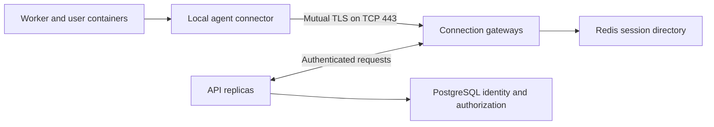

# Outbound agent tunnel design

Agents connect outbound to a dedicated LazyCloud hostname on TCP 443. The
connection uses mutual TLS and carries control requests and workload traffic.
Customers do not need inbound ports or a public machine address.

For installation, credentials, DNS, and rollout commands, use
[connection gateway deployment](connection-gateway.md). This document explains
the design and the acceptance needed when changing it.

## Request routing

The agent starts the connection. A request to a workload opens a stream through
its existing session. The agent resolves the authorized route ID to a registered
local destination. Callers cannot supply arbitrary customer-network addresses.

Worker and runner requests use the local connector, then travel through the
tunnel to the API. Their existing tokens still authorize the inner request.
User containers do not receive the machine private key.

The transport uses asynchronous gRPC over HTTP/2. Control traffic has separate
queues from bulk data so slow streams do not block heartbeats or cancellation.
Stream limits and queued-byte limits bound memory use.

## Identity and ownership

PostgreSQL preserves enrollment, credential generation, revocation, and task
ownership. Redis holds expiring session ownership and route registrations.
Gateways hold connections and stream buffers.

The deployment issuer signs certificates. Each agent and gateway generates
its own private key; only API pods hold the issuer key. Renewal does not
replace enrollment authorization. A revoked identity must lose both new-stream
access and existing session authority.

Directory updates use the unique connection ID so a delayed disconnect cannot
remove a newer session. Redis recovery re-registers sessions without creating
another machine, worker, or task.

## Deployment behavior

API and scheduler updates do not replace gateway connections. Gateway updates
drain replicas and ask agents to reconnect while accepted streams finish within
the configured drain period.

An abrupt gateway loss can interrupt streams. Read durable task state before
retrying a request whose outcome is unknown. Reconnection does not make an
arbitrary request safe to replay.

A machine must remain awake, support the container runtime, and allow outbound
access to the tunnel endpoint. TLS certificate validation remains required.

## Acceptance for transport changes

Use the current production route in Compose, packaged agents, and provider
workers. Exercise the boundaries affected by the change:

- Enrollment, certificate renewal, expiry, and revocation of an active session.
- Cross-workspace denial and rejection of unregistered local destinations.
- Reconnection after gateway loss and Redis recovery without duplicate dispatch.
- Functions, callbacks, HTTP and WebSocket traffic, logs, shell, cancellation,
  and image-build transfers.
- A slow stream alongside ordinary calls, with bounded memory and cancellation.
- API replacement, gateway drain, and agent replacement as separate scenarios.

Record terminal task outcomes, ownership, latency, and recovery time while
polling both ends' logs and provider state.

Run only against authorized targets. Remove the test workloads and temporary
credentials through their owners, then verify their absence. Healthy pods and
heartbeats alone do not prove workload traffic.
