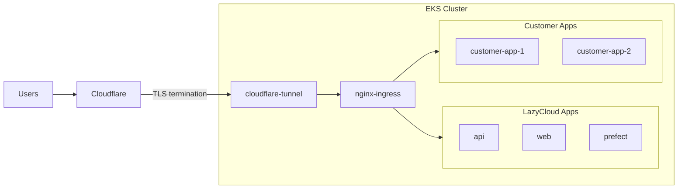
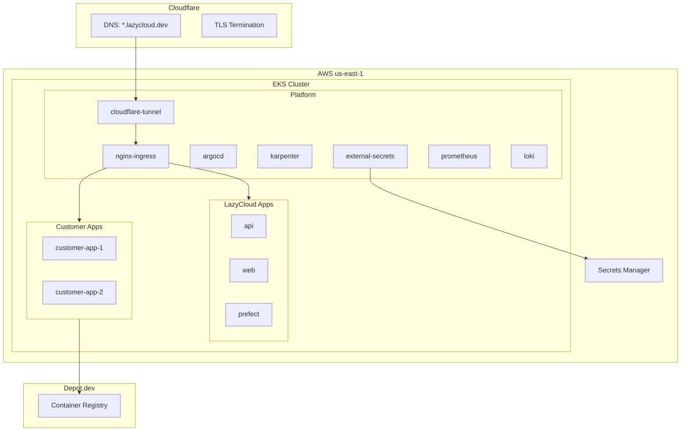
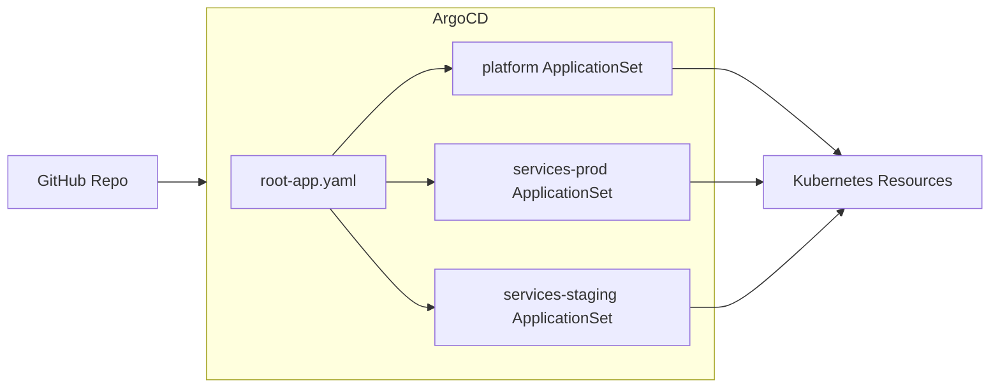
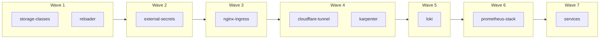

# Architecture

## Traffic Flow

```mermaid
flowchart LR
    Users --> Cloudflare
    Cloudflare -->|TLS termination| Tunnel[cloudflare-tunnel]

    subgraph EKS[EKS Cluster]
        Tunnel --> NGINX[nginx-ingress]

        subgraph LazyCloud[LazyCloud Apps]
            API[api]
            Web[web]
            Prefect[prefect]
        end

        subgraph Customer[Customer Apps]
            App1[customer-app-1]
            App2[customer-app-2]
        end

        NGINX --> LazyCloud
        NGINX --> Customer
    end
```

## System Overview

```mermaid
flowchart TB
    subgraph Cloudflare
        DNS[DNS: *.lazycloud.dev]
        TLS[TLS Termination]
    end

    subgraph AWS[AWS us-east-1]
        subgraph EKS[EKS Cluster]
            subgraph Platform
                Tunnel[cloudflare-tunnel]
                NGINX[nginx-ingress]
                ArgoCD[argocd]
                Karpenter[karpenter]
                ESO[external-secrets]
                Prometheus[prometheus]
                Loki[loki]
            end

            subgraph LazyCloud[LazyCloud Apps]
                API[api]
                Web[web]
                Prefect[prefect]
            end

            subgraph Customer[Customer Apps]
                App1[customer-app-1]
                App2[customer-app-2]
            end
        end

        SM[Secrets Manager]
    end

    subgraph Depot[Depot.dev]
        Registry[Container Registry]
    end

    DNS --> Tunnel
    Tunnel --> NGINX
    NGINX --> LazyCloud
    NGINX --> Customer
    ESO --> SM
    Customer --> Registry
```

## GitOps Flow

```mermaid
flowchart LR
    Git[GitHub Repo] --> ArgoCD

    subgraph ArgoCD
        Root[root-app.yaml]
        Root --> Platform[platform ApplicationSet]
        Root --> Prod[services-prod ApplicationSet]
        Root --> Staging[services-staging ApplicationSet]
    end

    Platform --> K8s[Kubernetes Resources]
    Prod --> K8s
    Staging --> K8s
```

## Sync Wave Order

```mermaid
flowchart LR
    subgraph Wave1[Wave 1]
        SC[storage-classes]
        R[reloader]
    end

    subgraph Wave2[Wave 2]
        ES[external-secrets]
    end

    subgraph Wave3[Wave 3]
        NG[nginx-ingress]
    end

    subgraph Wave4[Wave 4]
        CF[cloudflare-tunnel]
        KP[karpenter]
    end

    subgraph Wave5[Wave 5]
        LK[loki]
    end

    subgraph Wave6[Wave 6]
        PM[prometheus-stack]
    end

    subgraph Wave7[Wave 7]
        SVC[services]
    end

    Wave1 --> Wave2 --> Wave3 --> Wave4 --> Wave5 --> Wave6 --> Wave7
```
