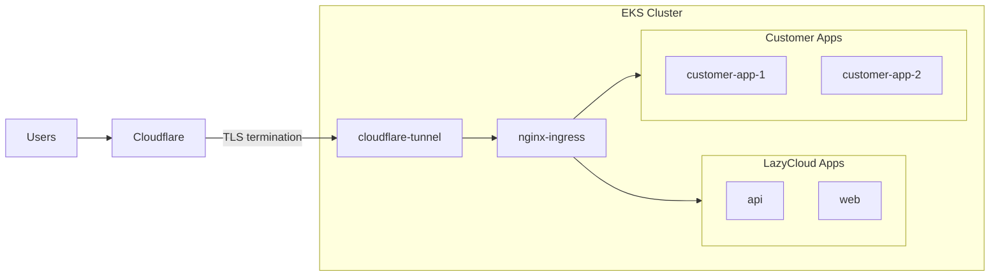
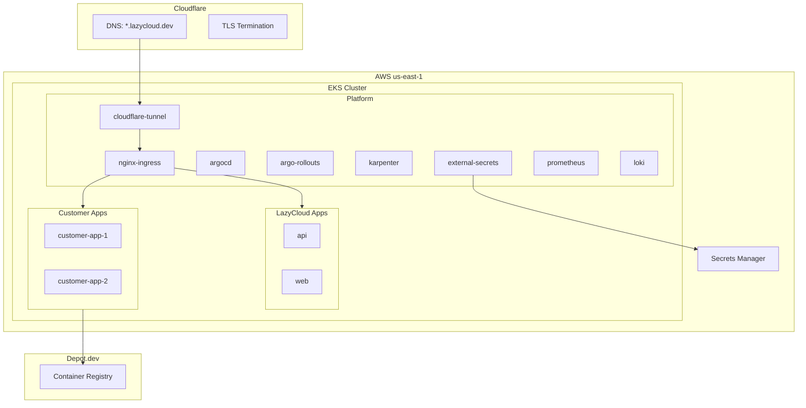
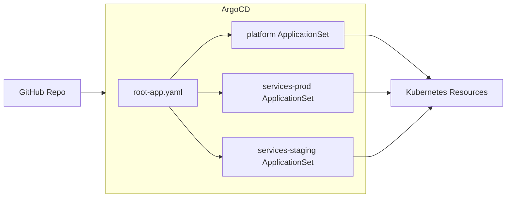
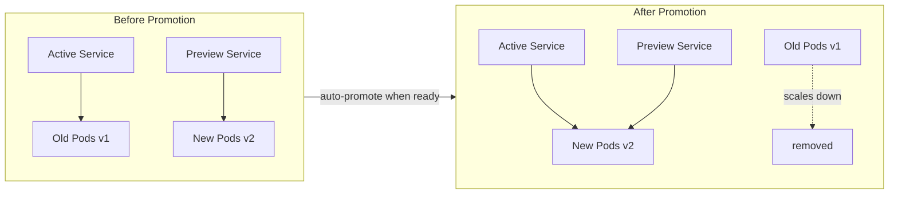

# Architecture

## Traffic Flow



## System Overview



## GitOps Flow



## Sync Wave Order

```mermaid
flowchart LR
    subgraph Wave1[Wave 1]
        SC[storage-classes]
        R[reloader]
        AR[argo-rollouts]
    end

    subgraph Wave2[Wave 2]
        ES[external-secrets]
    end

    subgraph Wave3[Wave 3]
        NG[nginx-ingress]
    end

    subgraph Wave4[Wave 4]
        CF[cloudflare-tunnel]
        KP[karpenter]
    end

    subgraph Wave5[Wave 5]
        LK[loki]
    end

    subgraph Wave6[Wave 6]
        PM[prometheus-stack]
    end

    subgraph Wave7[Wave 7]
        SVC[services]
    end

    Wave1 --> Wave2 --> Wave3 --> Wave4 --> Wave5 --> Wave6 --> Wave7
```



## Deployment Strategy

LazyCloud services use **blue-green deployments** via [Argo Rollouts](https://argo-rollouts.readthedocs.io/).



### How it works

1. **Deploy**: New pods spin up behind a preview service
2. **Verify**: Pods must pass readiness probes
3. **Promote**: Once all replicas are ready, traffic switches atomically
4. **Cleanup**: Old pods scale down after 30 seconds

### Configuration

Services using blue-green (`deploy/services/*/templates/deployment.yaml`):
- `web` - Frontend Next.js app
- `api-platform` - Backend FastAPI

Each has two services:
- **Active service** (`web`, `api-platform-api`) - receives production traffic
- **Preview service** (`web-preview`, `api-platform-api-preview`) - receives new version during rollout

### Manual operations

Check rollout status:
```bash
kubectl argo rollouts get rollout web -n lazycloud-prod
kubectl argo rollouts get rollout api-platform-api -n lazycloud-prod
```

Manually promote (if `autoPromotionEnabled: false`):
```bash
kubectl argo rollouts promote web -n lazycloud-prod
```

Abort and rollback:
```bash
kubectl argo rollouts abort web -n lazycloud-prod
kubectl argo rollouts undo web -n lazycloud-prod
```

Dashboard (if enabled):
```bash
kubectl argo rollouts dashboard -n argo-rollouts
```
